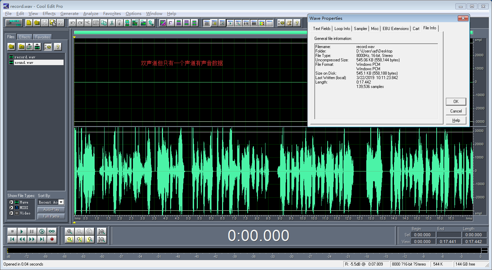
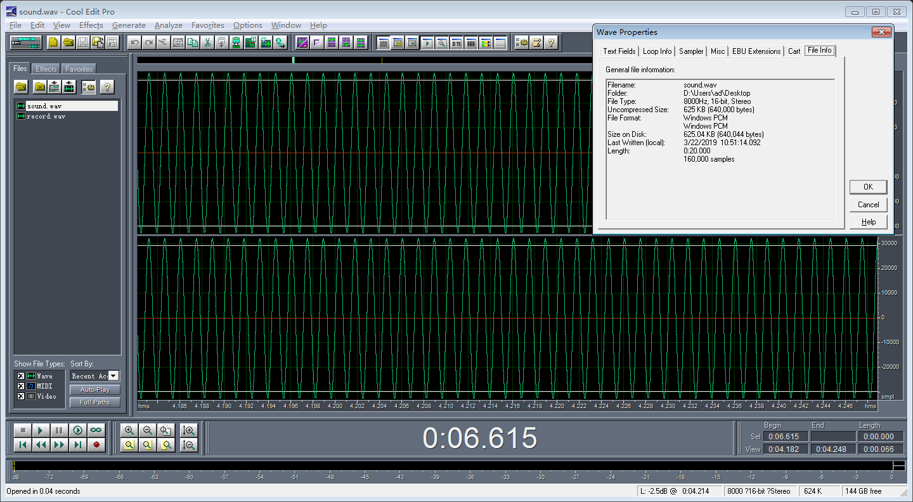

# README

## 参考文档

* [WaveFormat](http://soundfile.sapp.org/doc/WaveFormat/)
* [wavfile: A Simple Sound Library](https://www3.nd.edu/~dthain/courses/cse20211/fall2013/wavfile/)

## 生成蓝牙声音源代码

* 源代码：[wavfile](wavfile/)
* 编译：`make`
* 生成声音：`./wavfile`
* 生成的文件`sound.wav`是左右声道都有数据，其实只需要关注右声道数据就行了，BT数据传输只会关注右声道数据；

## 播放录音方法

* 删除`vendor/nxp-opensource/imx/alsa`生成库，防止声卡被占用：
  * `rm /vendor/lib/hw/audio.primary.imx8.so`
  * `rm /vendor/lib64/hw/audio.primary.imx8.so`
* 录音：`tinycap record.wav -D 1 -r 8000 -b 16`  
  
* 播放：`tinyplay sound.wav -D 1`  
  
