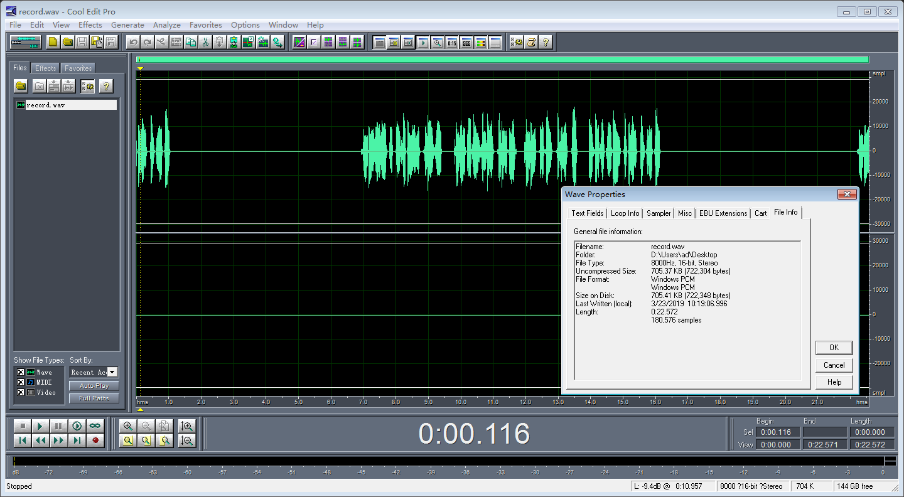

# PCM Interface I2S Master-Slave

* I2S接口分为Master/Slave之分，这里面涉及到谁来发出BCLK和LRCLK的问题，Master或者Slave都可以发出，看情况配置；
* 下面是内核中的相关配置，**是站在Codec的角度来看的，不是站在SoC的控制器角度来看的**；
  ```C
  /*
   * DAI hardware clock masters.
   *
   * This is wrt the codec, the inverse is true for the interface
   * i.e. if the codec is clk and FRM master then the interface is
   * clk and frame slave.
   */
  #define SND_SOC_DAIFMT_CBM_CFM		(1 << 12) /* codec clk & FRM master */
  #define SND_SOC_DAIFMT_CBS_CFM		(2 << 12) /* codec clk slave & FRM master */
  #define SND_SOC_DAIFMT_CBM_CFS		(3 << 12) /* codec clk master & frame slave */
  #define SND_SOC_DAIFMT_CBS_CFS		(4 << 12) /* codec clk & FRM slave */
  ```
* 如下是蓝牙电话PCM接口I2S数据格式录音效果：  
  